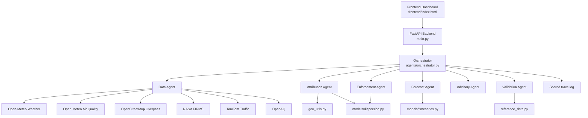

# AQI-Sentinel Architecture

## Overview
AQI-Sentinel is a **multi-agent urban air-quality intelligence platform** built for smart-city intervention workflows.

The system is designed to move beyond a conventional AQI dashboard. Instead of only reporting pollution levels, AQI-Sentinel combines environmental data, geospatial reasoning, forecasting, and explainable recommendations so that municipal users can answer:
- Why is the air bad here right now?
- How will AQI change over the next 24–72 hours?
- Where should enforcement teams be sent first?
- What should citizens be advised to do now?
- How reliable is the output, and how quickly was it generated?

The current implementation is a **FastAPI-based backend** with a **single-page frontend**, a **central orchestrator**, and six specialised agents:
- Data Agent
- Attribution Agent
- Forecast Agent
- Enforcement Agent
- Advisory Agent
- Validation Agent

## Design goals
AQI-Sentinel was intentionally structured around five core design goals.

### 1. Explainability
Every important output carries an explanation:
- Source contribution shares
- Confidence scores
- Causal narrative
- Trace log
- Benchmark comparison
- Response-time measurement

### 2. Modularity
Each capability is isolated into its own agent or utility module. This makes the codebase easier to extend and test.

### 3. Honest provenance
Every external input is marked as:
- `live`
- `fallback`
- `cache hit`

That makes the dashboard and API outputs explicit about whether a result came from a real service or a deterministic fallback.

### 4. Graceful degradation
When a public API is unavailable or a key is missing, the system does not fail silently. It returns a labelled fallback so the demo remains usable.

### 5. Hackathon practicality
The implementation is compact enough to run as a prototype, but still includes enough structure to demonstrate:
- Multi-agent reasoning
- Geospatial intelligence
- Atmospheric modelling
- Forecasting
- Validation
- Response-time benchmarking

## High-level system architecture


### What this means
1. The **frontend** requests a city, zone, or workflow endpoint.
2. The **FastAPI app** validates the request and delegates to the orchestrator.
3. The **orchestrator** invokes the relevant agents.
4. The **DataAgent** collects and normalises external data.
5. The specialist agents compute attribution, forecasts, enforcement ranking, advisories, and validation.
6. A **trace log** captures the actual execution path and is returned to the frontend.

## Backend layer
### 1. `main.py`
`main.py` is the entry point of the FastAPI application.

It defines:
- The `FastAPI` app object
- CORS middleware for local demo access
- Request validation helpers for city and zone IDs
- All API routes
- A health endpoint
- A favicon endpoint returning HTTP 204

### 2. API router responsibilities
The router itself stays thin. It does not contain business logic. It only:
- Validates input
- Calls the orchestrator
- Returns JSON responses

This keeps the app easy to reason about and keeps the business logic inside the agents.

## Agent layer
### 1. Data Agent
The Data Agent is the only component that talks directly to external services.

It fetches:
- Weather data from Open-Meteo
- Air-quality data from Open-Meteo Air Quality
- Land-use and POI data from OpenStreetMap Overpass
- Thermal anomaly data from NASA FIRMS
- Traffic congestion from TomTom
- Station validation data from OpenAQ

It also manages:
- Cache hits
- Fallback generation
- Source labelling
- Circuit breaking for repeated Overpass failures

### 2. Attribution Agent
The Attribution Agent combines live data and geospatial reasoning to estimate pollution source contributions for a zone.

It uses:
- Current AQI and pollutant readings
- Wind direction and speed
- Nearby industrial and construction features
- Traffic congestion
- Thermal anomaly counts
- Real coordinates of nearby OSM features

It outputs:
- AQI
- Source contribution shares
- Confidence values
- Causal narrative
- Upwind source candidates
- Sensor and signal summary

### 3. Forecast Agent
The Forecast Agent produces a 72-hour AQI forecast for a zone.

It uses:
- Open-Meteo’s air-quality forecast
- Historical AQI samples
- A backtesting model in `models/timeseries.py`

It returns:
- Forecast source
- Forward forecast values
- History length used for backtesting
- Backtest metrics when enough history is available

### 4. Enforcement Agent
The Enforcement Agent ranks zones for intervention using the attribution result plus a dispersion model.

It combines:
- AQI severity
- Top-source confidence
- A simple exposure proxy
- Gaussian plume estimates
- The nearest currently upwind real source when one exists

It returns:
- Ranked zones
- Scores
- Plume concentration estimates
- Source references
- A specific primary target where possible

### 5. Advisory Agent
The Advisory Agent creates short citizen advisories in the requested language.

It uses:
- AQI category
- Nearby vulnerability layer from OSM schools and hospitals
- Optional Claude-generated text
- Template fallback messages if no LLM is configured

It returns:
- Advisory text
- Language code
- AQI category
- Vulnerability summary
- Generator type

### 6. Validation Agent
The Validation Agent compares city-level attribution output against published benchmark studies in `reference_data.py`.

It returns:
- Study metadata
- Number of categories compared
- Mean absolute error
- Per-category comparison table
- Explicit flags for categories without an independent benchmark

## Core module responsibilities
### `geo_utils.py`
Provides geospatial utilities:
- Haversine distance
- Compass bearing
- Angular difference
- Compass labels
- Bounding-box generation
- Upwind detection

These functions are essential to connect a point source in the city with the current wind direction.

### `models/dispersion.py`
Implements a simplified Gaussian plume model.

It includes:
- Stability class estimation
- Pasquill-Gifford / Briggs rural coefficients
- Plume concentration estimation at multiple downwind distances
- A simple emission-rate proxy derived from land-use counts and AQI

### `models/timeseries.py`
Implements additive Holt-Winters forecasting plus backtesting utilities.

It includes:
- Seasonal naive forecasting
- Holt-Winters additive forecasting
- Holt linear forecasting
- RMSE-based backtesting against a persistence baseline

### `reference_data.py`
Stores city-specific reference studies for validation.

Important point: The code does **not** assume a universal ground truth. It only compares overlapping categories that a study explicitly reports.

### `cache.py`
Implements an in-memory TTL cache so repeated API calls do not hammer public services during a demo.

### `circuit_breaker.py`
Prevents repeated long waits when Overpass is repeatedly failing.

### `concurrency.py`
Runs zone-level work in parallel with a `ThreadPoolExecutor`.

### `cities.py`
Stores city metadata and zone coordinates used throughout the platform.

### `config.py`
Centralises environment variables, endpoint URLs, timeout values, and the optional LLM toggle.

## Data flow by capability
### 1. Source attribution flow
1. Fetch weather, AQI, land-use, traffic, thermal, and station inputs.
2. Determine nearby OSM industrial and construction features.
3. Compute distance and bearing from the zone to each feature.
4. Compare the source bearing against the wind direction.
5. Build attribution shares and confidence scores.
6. Generate a causal narrative and trace output.

### 2. Forecast flow
1. Fetch AQI history and forecast from Open-Meteo.
2. Split the series into history and forward horizon.
3. Backtest the internal time-series model on real historical data.
4. Compare the model against persistence.
5. Return the forecast and backtest metrics.

### 3. Enforcement flow
1. Run attribution for every zone in the city.
2. Compute severity and confidence.
3. Fetch weather and land-use again for plume modelling.
4. Estimate a rough plume concentration profile.
5. Select a real upwind candidate source when possible.
6. Rank the zones by intervention priority.

### 4. Advisory flow
1. Fetch land-use and vulnerability signals.
2. Run attribution to obtain AQI and category.
3. Ask the LLM to generate advisory text if configured.
4. Otherwise use the template fallback for the selected language.
5. Return the message and provenance.

### 5. Validation flow
1. Run attribution across all city zones.
2. Compute city-level category averages.
3. Compare against the benchmark study for that city.
4. Report MAE only where comparison is valid.
5. Flag the rest as unbenchmarked.

## Tracing and observability
Every agent logs into a shared trace list. Each trace item has the shape:
```json
{
  "agent": "Data Agent",
  "action": "fetch_weather",
  "source": "live",
  "detail": "open-meteo forecast API",
  "t": 1712345678.123
}
```

This trace is returned by the API and displayed in the frontend.

The trace is useful because it shows:
- Which agent ran?
- Which external service it touched?
- Whether the result was live or fallback?
- What the system was doing at each step?

That makes the system much easier to debug and much more credible in a live demo.

## Runtime resilience
### 1. Cache
The TTL cache reduces repeated network calls within a short demo window.

### 2. Circuit breaker
The Overpass circuit breaker avoids paying repeated timeout costs if the service is down.

### 3. Fallback generation
When live data cannot be fetched, the platform still produces structured outputs using deterministic fallback values.

### 4. Optional LLM upgrade
If `ANTHROPIC_API_KEY` is present, the platform can use Claude for:
- Attribution reasoning
- Advisory generation

If the key is absent or a call fails, the system falls back cleanly to rule-based outputs.

## Concurrency model
The platform uses concurrency where it matters most: multi-zone workloads.

The heavy city-wide operations are:
- City overview
- Enforcement ranking
- Validation

These workloads process zones in parallel instead of sequentially.

Why this matters:
- Each zone can require several external requests
- Blocking network I/O benefits from thread-based concurrency
- The practical result is a major reduction in wall-clock latency for 10-zone cities

## Output provenance
AQI-Sentinel intentionally exposes data provenance.

Outputs are labelled as:
- `live`
- `fallback`
- `cache hit`
- `not_configured`
- `template_fallback`
- `template_llm_error`

This is important because it avoids misleading the user into believing all results are equally real-time.

## Current limitations
This repository is a hackathon prototype, not a production regulatory system.

Known limitations:
- Some external data depends on optional API keys
- Public APIs may rate-limit or time out
- The dispersion model is simplified
- Validation is benchmark-based rather than universal
- Caching is in-memory only
- The frontend is intentionally lightweight and static

These are acceptable constraints for a build-sprint prototype, but they matter if the system is extended into production.

## Extension points
The current architecture leaves room for future work without requiring a rewrite.

Obvious extensions include:
- PostGIS-backed storage
- Persistent time-series database
- Richer satellite fusion
- Digital twin integration
- Push alerts and notifications
- Mobile advisory delivery
- Stronger dispersion modelling
- Deployment via Docker and cloud infrastructure
- More cities and zones
- Richer multilingual LLM advisories

## Summary
AQI-Sentinel is structured as a **modular, explainable, multi-agent smart-city air-quality system**.

Its architecture is intentionally simple in the right places and specialised where needed:
- One backend
- One orchestrator
- Six agents
- Real APIs
- Deterministic fallbacks
- Transparent traces
- Measurable outputs